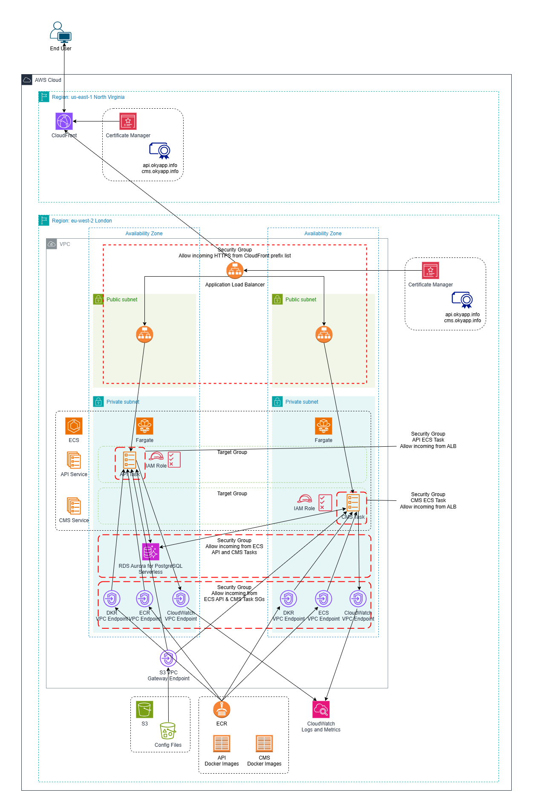

# Project Oky Backend Deployment on AWS

This document provides a technical overview of the AWS deployment for the Project Oky backend API and CMS. It is intended for DevOps engineers and assumes a working knowledge of AWS services.

## Architecture Overview

The architecture consists of a multi-tier setup leveraging various AWS services for scalability, security, and reliability. User traffic originates from mobile applications and web browsers, flowing through CloudFront to an Application Load Balancer (ALB), which then routes requests to containerized API and CMS applications running on ECS Fargate. An AWS-managed RDS Aurora Serverless database serves as the persistent data store. While many components like the Application Load Balancer and ECS service configuration are designed for high availability by utilizing multiple Availability Zones, the RDS Aurora Serverless database is currently deployed as a single writer instance in one Availability Zone. This makes the database tier, and therefore the overall system, not highly available at present, though it is architected to facilitate a transition to HA. The accompanying architecture diagram depicts ECS tasks for different services as running in separate Availability Zones - this is for illustrative purpose only - the services are configured to deploy into either AZ and the number of tasks is currently set at a single task for each service (API and CMS), which could be placed in either of the available private subnets based on ECS scheduling.



## Rationale for ECS Deployment

The decision to deploy the backend API and CMS applications using Amazon Elastic Container Service (ECS) with AWS Fargate, rather than Amazon Elastic Kubernetes Service (EKS) or a self-managed Kubernetes cluster, was based on the following considerations:

*   **Docker Image Compatibility:** ECS natively supports Docker containers, aligning with the project's existing practice of packaging applications as Docker images, as detailed in other project documentation.
*   **Managed Infrastructure and Reduced Operational Overhead:** AWS Fargate, as a serverless compute engine for containers, abstracts away the need to provision, configure, and manage the underlying server infrastructure. This significantly reduces the operational effort compared to managing an EKS cluster or self-hosted Kubernetes, allowing the team to focus more on application development and deployment.
*   **Simplified Tooling with AWS CLI:** The AWS Command Line Interface (CLI) provides comprehensive capabilities for managing ECS resources, including task definitions, services, and clusters. For the current scale and complexity, the AWS CLI offers a simpler and more direct management experience compared to the learning curve and operational complexity associated with `kubectl` and Kubernetes manifests.
*   **Future Flexibility:** While ECS meets the current requirements effectively, the architecture does not preclude a future migration to EKS or a self-managed Kubernetes environment if the project's needs evolve to require the specific features or ecosystem of Kubernetes.

## Key Components

* **CloudFront:**
    * Acts as the entry point for all user traffic, providing global content delivery.
    * Reduces the distance between the client or end user and the entry point to the backed system, helping to reduce latency.
    * Configured with the Application Load Balancer (ALB) as the sole origin.
    * Accepts requests for `api.okyapp.info` and `cms.okyapp.info`.
    * Caching is currently disabled. WAF can be integrated at a later stage if required.

* **Certificate Manager (ACM):**
    * **us-east-1:** Used for the CloudFront distribution to provide HTTPS to end-users.
    * **eu-west-2:** Used for the Application Load Balancer to ensure HTTPS communication between CloudFront and the ALB.

* **Application Load Balancer (ALB):**
    * Serves as the single point of contact for traffic within the AWS environment.
    * Deployed across public subnets in multiple Availability Zones to provide high availability for ingress traffic.
    * Listens on HTTPS and routes traffic based on the `Host` header:
        * Requests with `Host: api.okyapp.info` are forwarded to the API ECS task Target Group.
        * Requests with `Host: cms.okyapp.info` are forwarded to the CMS ECS task Target Group.
        * Any other requests are forwarded to the API ECS task Target Group (default rule).
    * Associated Security Group allowing incoming HTTPS traffic from the CloudFront IP address prefix list.

* **Elastic Container Service (ECS):**
    * Manages the containerized API and CMS applications using the Fargate launch type.
    * **ECS Task Definitions:**
        * `project-oky-ecs-api-task`
        * `project-oky-ecs-cms-task`
    * **ECS Services:**
        * **API Service:** Runs one replica of the API task.
        * **CMS Service:** Runs one replica of the CMS task.
    * ECS tasks for both API and CMS can be deployed in either of the private subnets within the VPC.
    * Docker images for the API and CMS tasks are stored in separate ECR repositories.
    * **ECS Task IAM Roles:**
        * API Task Role
        * CMS Task Role
        * Both roles have permissions to read all objects from a specific S3 bucket (defined in the policy) used for environment variable configuration.
    * **ECS Task Security Groups:**
        * API Task Security Group: Allows all incoming traffic from the ALB security group.
        * CMS Task Security Group: Allows all incoming traffic from the ALB security group.
    * **ECR Repositories:**
        * API Image
        * CMS Image

* **Configuration Management (S3):**
    * Environment variables for ECS tasks are stored in files within an S3 bucket.
    * Each ECS Service's task definition points to a specific environment file in this bucket.
    * **API Task Configuration:** Copy `project_oky_api_task_configuration.dist.env` to `project_oky_api_task_configuration.env` and populate with values from your deployment
    * **CMS Task Configuration:** Copy `project_oky_cms_task_configuration.dist.env` to `project_oky_cms_task_configuration.env` and populate with values from your deployment

* **RDS Aurora Serverless:**
    * Managed PostgreSQL-compatible database service.
    * Configured with a single writer instance. It is **not** a Multi-AZ deployment; the primary instance is located in Availability Zone 1 (eu-west-2a).
    * The DB subnet group associated with the cluster includes subnets for both Availability Zone 1 (eu-west-2a) and Availability Zone 2 (eu-west-2b) to allow for potential future HA configurations or read replica placement, though it currently operates as a single-instance setup in AZ1.
    * Scaling configured with a minimum ACU of 0 and a maximum ACU of 1.
    * Idle time before pausing is set to 5 minutes.
    * AWS-managed backups are configured with a daily backup and a retention period of 7 days.
    * Security Group allowing PostgreSQL traffic from both the ECS API and CMS task security groups.
    * **Database Migrations:** If deploying a fresh installation (i.e. there is no current database to migrate over), then the process for initial database creation and subsequent schema migrations is detailed in separate project documentation.

* **Virtual Private Cloud (VPC):**
    * Provides an isolated network environment for the deployment.
    * Contains public subnets (for the ALB) and private subnets (for ECS Fargate tasks and RDS).

* **VPC Endpoints:**
    * Configured for enhanced security, ensuring traffic to specific AWS services remains within the VPC.
    * Interface VPC endpoints (for CloudWatch Logs, ECR API, ECR DKR) are deployed with network interfaces in multiple Availability Zones, enhancing resilience for accessing these services privately.
    * Endpoints are in place for:
        * S3 (gateway endpoint)
        * CloudWatch Logs (interface endpoint)
        * ECR API (interface endpoint - for ECR actions like `DescribeRepositories`)
        * ECR DKR (interface endpoint - for Docker image push/pull access to the registry)
    * A single Security Group is associated with the interface VPC endpoints (CloudWatch Logs, ECR API, ECR DKR). This security group allows all incoming traffic from both the ECS API task and ECS CMS task security groups. Note that S3 gateway endpoints do not use security groups.

* **IAM Roles:**
    * API Task Role and CMS Task Role: Allow the respective ECS tasks to access necessary AWS resources, specifically the S3 bucket for environment variable configuration.

## Prerequisites for Deployment/Management

*   **Docker Image Builder:** Requires IAM permissions for push access to the ECR repositories (`oky/api_en` and `oky/cms_en`).
*   **Service Updater:** Requires IAM permissions for update access to ECS task definitions and service definitions for `project-oky-ecs-api-task` and `project-oky-ecs-cms-task`.
*   **AWS CLI:** Configured with appropriate credentials and default region (`eu-west-2`).
*   **Docker:** Installed and operational for building and pushing images.

## Sample IAM Policies

Below are sample IAM policies that can be used as a starting point for the "Docker Image Builder" and "Service Updater" roles. These policies should be further restricted based on the principle of least privilege.

### Docker Image Builder Policy

This policy grants permissions to authenticate with ECR and push images to the specified repositories.

```json
{
    "Version": "2012-10-17",
    "Statement": [
        {
            "Sid": "AllowECRAuth",
            "Effect": "Allow",
            "Action": [
                "ecr:GetAuthorizationToken"
            ],
            "Resource": "*"
        },
        {
            "Sid": "AllowECRImagePush",
            "Effect": "Allow",
            "Action": [
                "ecr:BatchCheckLayerAvailability",
                "ecr:CompleteLayerUpload",
                "ecr:InitiateLayerUpload",
                "ecr:PutImage",
                "ecr:UploadLayerPart"
            ],
            "Resource": [
                "arn:aws:ecr:eu-west-2:637423184246:repository/oky/api_en",
                "arn:aws:ecr:eu-west-2:637423184246:repository/oky/cms_en"
            ]
        }
    ]
}
```

### Service Updater Policy

This policy grants permissions to describe and register ECS task definitions, and update ECS services. It also includes `iam:PassRole` to allow ECS to pass the task IAM roles to the tasks.

```json
{
    "Version": "2012-10-17",
    "Statement": [
        {
            "Sid": "AllowECSTaskDefinitionManagement",
            "Effect": "Allow",
            "Action": [
                "ecs:DescribeTaskDefinition",
                "ecs:RegisterTaskDefinition"
            ],
            "Resource": [
                "arn:aws:ecs:eu-west-2:637423184246:task-definition/project-oky-ecs-api-task:*",
                "arn:aws:ecs:eu-west-2:637423184246:task-definition/project-oky-ecs-cms-task:*"
            ]
        },
        {
            "Sid": "AllowECSServiceUpdate",
            "Effect": "Allow",
            "Action": [
                "ecs:UpdateService"
            ],
            "Resource": [
                "arn:aws:ecs:eu-west-2:637423184246:service/project-oky-ecs-cluster/project-oky-ecs-api-task-service-1lehr9r5",
                "arn:aws:ecs:eu-west-2:637423184246:service/project-oky-ecs-cluster/project-oky-ecs-cms-task-service-smibyuqs"
            ]
        },
        {
            "Sid": "AllowPassRoleForECSTasks",
            "Effect": "Allow",
            "Action": "iam:PassRole",
            "Resource": [
                "arn:aws:iam::637423184246:role/project-oky-ecs-api-task-role",
                "arn:aws:iam::637423184246:role/project-oky-ecs-cms-task-role"
            ],
            "Condition": {
                "StringEquals": {
                    "iam:PassedToService": "ecs-tasks.amazonaws.com"
                }
            }
        }
    ]
}
```

## Deployment and Update Process

The deployment process involves two main phases: building and pushing Docker images to ECR, and then updating the ECS services to use these new images.

### 1. Build and Push Docker Images

Instructions for building the Docker images for the API and CMS components are detailed in separate project documentation. Once the images are built locally:

*   **Authenticate Docker with ECR:**
    ```bash
    aws ecr get-login-password --region eu-west-2 | docker login --username AWS --password-stdin <YOUR_AWS_ACCOUNT_ID>.dkr.ecr.eu-west-2.amazonaws.com
    ```

*   **Tag and Push API Image (example tag: `2025_05`):**
    ```bash
    docker tag your-local-api-image:2025_05 <YOUR_AWS_ACCOUNT_ID>.dkr.ecr.eu-west-2.amazonaws.com/oky/api_en:2025_05
    docker push <YOUR_AWS_ACCOUNT_ID>.dkr.ecr.eu-west-2.amazonaws.com/oky/api_en:2025_05
    ```

*   **Tag and Push CMS Image (example tag: `2025_05`):**
    ```bash
    docker tag your-local-cms-image:2025_05 <YOUR_AWS_ACCOUNT_ID>.dkr.ecr.eu-west-2.amazonaws.com/oky/cms_en:2025_05
    docker push <YOUR_AWS_ACCOUNT_ID>.dkr.ecr.eu-west-2.amazonaws.com/oky/cms_en:2025_05
    ```
    *(Replace `your-local-api-image:tag` and `your-local-cms-image:tag` with the actual local image names and their existing tags. Replace `2025_05` with the current `YYYY_MM` value. ECR repositories are configured with immutable tags, so each push must use a unique tag. Replace `<YOUR_AWS_ACCOUNT_ID>` with the actual AWS Account ID.)*

### 2. Update ECS Task Definitions and Services

This can be done via the AWS Management Console or AWS CLI.

**Using AWS CLI:**

*   **Update ECS Task Definition:**
    Create a new revision of the task definition, updating the `image` property within the container definitions to point to the new ECR image URI (including the new tag).

    *   First, get the current task definition for the API task:
        ```bash
        aws ecs describe-task-definition --task-definition project-oky-ecs-api-task --region eu-west-2 > project-oky-ecs-api-task-def.json
        ```
    *   Modify the `project-oky-ecs-api-task-def.json` file:
        *   Update the `image` field for the container to the new ECR image URI (e.g., `<YOUR_AWS_ACCOUNT_ID>.dkr.ecr.eu-west-2.amazonaws.com/oky/api_en:2025_05`).
        *   Remove unsupported fields for registration like `taskDefinitionArn`, `revision`, `status`, `requiresAttributes`, `compatibilities`, `registeredAt`, `registeredBy`.
    *   Register the new task definition:
        ```bash
        aws ecs register-task-definition --cli-input-json file://project-oky-ecs-api-task-def.json --region eu-west-2
        ```
    *   Repeat these steps for the `project-oky-ecs-cms-task`.

*   **Update ECS Service:**
    Update the service to use the new task definition revision.

    *   For the API service:
        ```bash
        aws ecs update-service --cluster project-oky-ecs-cluster --service project-oky-ecs-api-task-service --task-definition project-oky-ecs-api-task:<new-revision-number> --region eu-west-2
        ```
    *   For the CMS service:
        ```bash
        aws ecs update-service --cluster project-oky-ecs-cluster --service project-oky-ecs-cms-task-service --task-definition project-oky-ecs-cms-task:<new-revision-number> --region eu-west-2
        ```
    *(Replace `<new-revision-number>` with the actual new revision number obtained after registering the task definition. Replace service names with actual values if different from task definition names.)*

## Logging and Monitoring

*   **CloudWatch Log Groups:**
    *   API Task Logs
        *   Retention: 1 week
    *   CMS Task Logs
        *   Retention: 1 week
    *   ECS Cluster Performance Insights
        *   Retention: 1 day
*   **Dashboards and Alarms:** Currently, no custom CloudWatch dashboards or alarms are configured. This is a potential area for future enhancement (see Future Considerations).

## Security Considerations

* **HTTPS:** End-to-end HTTPS encryption is enforced using ACM certificates for both CloudFront and the ALB.  Communication between the ALB and the API and CMS tasks is **not** over HTTPS.
* **Security Groups:** Network access is controlled through Security Groups at various levels (ALB, ECS Tasks, RDS, VPC Endpoints), restricting traffic from authorized sources.
* **VPC Endpoints:** Private connectivity to AWS services like S3, CloudWatch Logs, and ECR (Docker registry) is established via VPC Endpoints, minimizing exposure to the public internet. There is no NAT Gateway from the private subnets to the public internet.
* **IAM Least Privilege:** IAM roles assigned to ECS tasks grant only the necessary permissions (read-only access to the configuration S3 bucket).
* **RDS Security:** Access to the RDS Aurora database is limited to the ECS tasks through the database security group.

## Traffic Flow

1.  Users (mobile app or desktop browser) initiate a request to either `api.okyapp.info` or `cms.okyapp.info`.
2.  DNS resolves to the CloudFront distribution by CNAME record.
3.  CloudFront forwards the HTTPS request to the Application Load Balancer (ALB).
4.  The ALB's listener on HTTPS inspects the `Host` header.
5.  Based on the `Host` header, the ALB routes the traffic to the corresponding Target Group:
    * `api.okyapp.info` -> API ECS Task Target Group
    * `cms.okyapp.info` -> CMS ECS Task Target Group
    * Default (`else`) -> API ECS Task Target Group
6.  The ALB forwards the request to one of the healthy ECS tasks (API or CMS) running on Fargate within the private subnets.
7.  The ECS task communicates with the RDS Aurora Serverless database as needed.
8.  Responses follow the reverse path back to the user.

## Scaling

The current architecture is designed with scalability in mind, leveraging several AWS services that can be scaled to meet changing demands. Both the API and CMS services run a single ECS task, which may be sufficient for current load but can be scaled if necessary.

Key scaling dimensions include:

*   **ECS Services (API and CMS Tasks):**
    *   **Task Count (Horizontal Scaling):** The number of Fargate tasks for both the API and CMS services can be increased. This is the primary method for handling more concurrent requests. Auto Scaling policies can be configured based on CloudWatch metrics like CPU utilization, memory utilization, or custom application metrics (e.g., request queue depth if applicable).
    *   **Task Size (Vertical Scaling):** The CPU and memory allocated to each Fargate task can be increased if individual tasks become resource-constrained. This involves updating the ECS Task Definitions.
*   **Application Load Balancer (ALB):**
    *   The ALB automatically scales to handle varying loads of incoming traffic. No manual intervention is typically required for ALB scaling itself.
*   **RDS Aurora Serverless:**
    *   The database is configured as Aurora Serverless v2, which automatically scales its capacity (ACUs - Aurora Capacity Units) up or down based on demand. The current configuration is a minimum of 0 ACU and a maximum of 1 ACU. This maximum can be increased if the database becomes a bottleneck. For sustained high loads or more predictable performance, migrating to provisioned Aurora instances could be considered, offering more granular control and potentially faster scaling responses.  Migration to a provisioned instance is possible if the serverless deployment type does not provide the required level of service.
*   **CloudFront:**
    *   CloudFront is a globally distributed service and scales automatically to handle large volumes of traffic and requests.

**Conceptual Scaling Process:**

1.  **Monitor Key Metrics:** Continuously monitor application performance (latency, error rates), ECS task utilization (CPU, Memory), ALB metrics (request count, target connection errors), and RDS metrics (CPU utilization, connections, ACU consumption) using CloudWatch.
2.  **Identify Bottlenecks:** Based on monitoring, identify which component is becoming a bottleneck.
3.  **Scale Appropriately:** 
    *   If ECS tasks are the bottleneck, increase the desired count or configure Auto Scaling for the respective ECS service. If individual tasks are hitting CPU/memory limits, increase task definition resources.
    *   If the RDS database is the bottleneck, adjust the maximum ACUs for Aurora Serverless or consider migrating to a different Aurora configuration.
4.  **Test and Validate:** After scaling, continue monitoring to ensure the changes have had the desired effect and haven't introduced new issues.

## Observability with CloudWatch

AWS CloudWatch is central to providing observability into the health, performance, and operational aspects of the Project Oky backend. It offers a suite of tools to collect and track metrics, collect and monitor log files, set alarms, and react to changes in your AWS resources.

*   **Metrics Collection:**
    *   **ECS:** CloudWatch automatically collects metrics for ECS services and tasks, including CPU and Memory Utilization, running task count. Container Insights (currently enabled for `/aws/ecs/containerinsights/project-oky-ecs-cluster/performance`) provides more detailed performance monitoring, including container-level metrics.
    *   **ALB:** The Application Load Balancer publishes metrics such as request count, error counts (HTTP 4xx, 5xx), target connection errors, healthy/unhealthy host counts, and request latency.
    *   **RDS Aurora Serverless:** Metrics like CPUUtilization, DatabaseConnections, ACUUtilization, FreeableMemory, and various I/O metrics are available.
    *   **CloudFront:** Provides metrics on requests, data transfer, error rates, and cache hit rates.
    *   **Custom Metrics:** Applications can publish custom metrics to CloudWatch (e.g., processing time for specific API endpoints, queue lengths) for more granular insight.

*   **Log Management:**
    *   **ECS Task Logs:** Logs from the API and CMS application containers are sent to CloudWatch Logs (groups `/ecs/project-oky-ecs-api-task` and `/ecs/project-oky-ecs-cms-task`). These logs are crucial for debugging application errors and understanding behavior.
    *   **ALB Access Logs:** Can be configured to send detailed logs of all requests to an S3 bucket, which can then be analyzed.
    *   **CloudTrail Logs:** Provides a record of API calls made to AWS services, useful for security auditing and operational troubleshooting.

*   **Alarms and Notifications:**
    *   CloudWatch Alarms can be set on any metric. For example, alarms can be configured for:
        *   High CPU/Memory utilization on ECS tasks.
        *   Increased ALB 5xx error rates or target connection errors.
        *   High RDS CPU utilization or low freeable memory.
        *   Specific error patterns in application logs (using metric filters).
    *   Alarms can trigger notifications (e.g., via SNS to email or Slack) or automated actions (e.g., scaling ECS services).

*   **Dashboards:**
    *   Custom CloudWatch Dashboards can be created to visualize key metrics from different services in one place. This provides an at-a-glance view of system health and performance, helping to quickly identify trends or anomalies.

**Capacity Insights:**

By analyzing these CloudWatch metrics and logs, you can gain insights into how well the current capacity is managing requests:

*   **ECS Task Utilization:** Consistently high CPU or memory utilization on ECS tasks indicates they are nearing capacity. Low utilization might suggest over-provisioning.
*   **ALB Metrics:** Rising target connection errors or increased latency can indicate that backend services are struggling to keep up with the request load.
*   **RDS Performance:** High CPU utilization, low freeable memory, or increasing query latency on the RDS instance can signal that the database is a bottleneck.
*   **Request Rates and Error Rates:** Tracking request rates against error rates and latency helps understand the system's performance under different load conditions.

This data-driven approach allows for informed decisions about when and how to scale resources, ensuring the application remains performant and reliable.

This document provides a snapshot of the current architecture. Further details on specific configurations and deployment processes may be documented separately.
